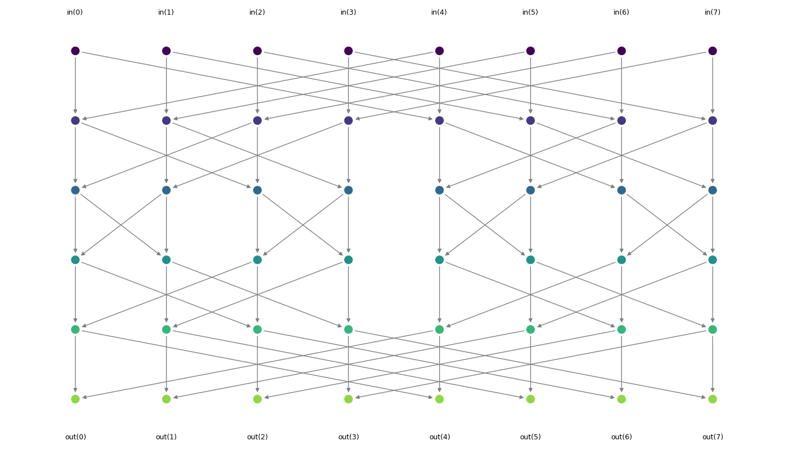
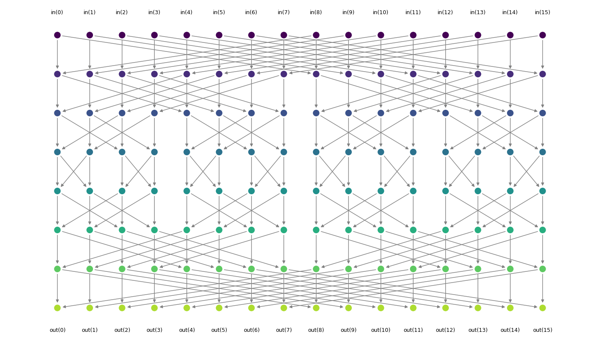
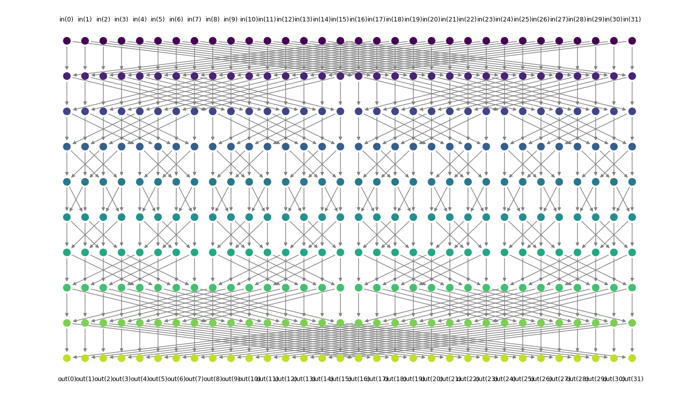
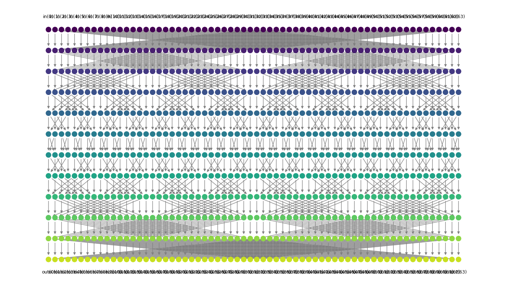

# Butterfly Network Visualizer

A Python tool for constructing and visualizing butterfly networks with recursive topology using `NetworkX` and `Matplotlib`.

## What It Does
- Builds a **butterfly network** for any size `n` (as long as `n` is a power of 2).
- Visualizes each stage of the network with clearly laid-out nodes and directional edges.

##  How It Works

1. **`build_butterfly_network(n)`**  
   Constructs a directed graph with `2 * log₂(n)` stages. Each node is identified by its `(stage, index)`, and edges are drawn between appropriate pairs to reflect butterfly topology.

2. **`draw_butterfly_network(G, stages, n)`**  
   Lays out the network horizontally and colors each stage for clarity. Inputs and outputs are labeled, and arrows show the data flow.


## Requirements

Install dependencies:

```bash
pip install matplotlib networkx
```

## Gallery  
| `n=8` | `n=16` |
|-------|--------|
|  |  |

| `n=32` | `n=64` |
|--------|--------|
|  |  |


---
